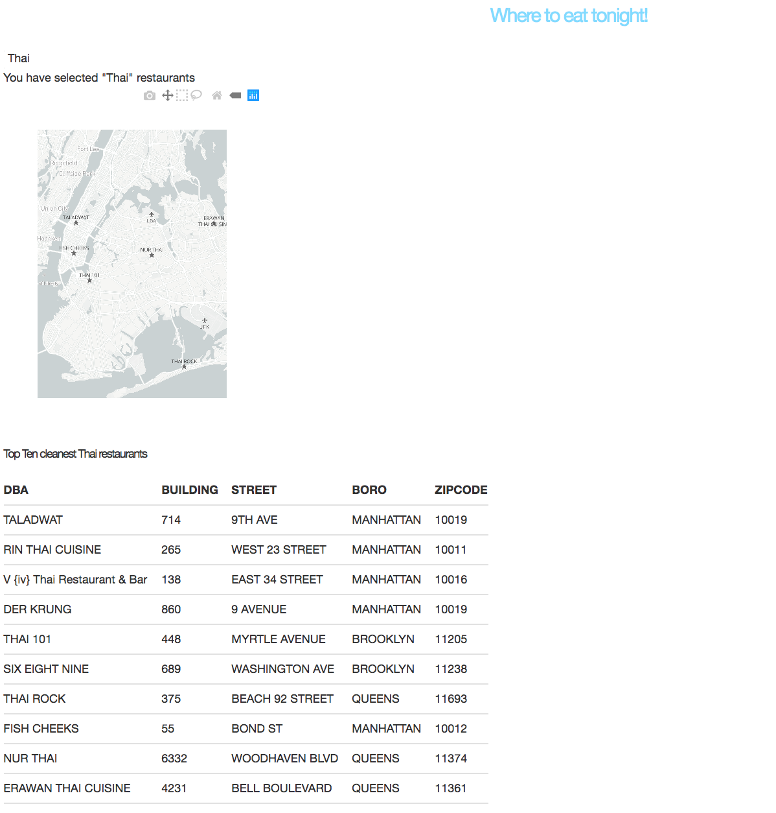

# Visualise NYC restaurant inspection data

This code creates a dashboard:
.

The dashboard filters the NYC restaurant inspection data to find the top ten
most hygienic restaurants under a given category (cuisine type). It has a 
dropdown menu for choosing the cuisine type you are interested in 
(the default is Thai). The app will query the google maps API and pull the 
latitude and longitude of each of the ten restaurants and display the 
results on a map of NYC. A table of the ten restaurants is also displayed.

The main functionality of the code is demonstrated in the notebook `viz.ipynb`

## Notes on ETL

The size of the data is relatively small and unlikely to grow significantly 
over time because the number of restaurants in NYC is likely to increase
only by a factor of 10 or less. I could have made an ETL pipeline to
pull the data into a star schema database (separate tables of restaurants, 
addresses, violation codes, cuisine descriptions, inspection types all 
with foreign keys in a table of the inspection results) but that seemed 
overkill for the size of the data set and the analysis. 

Instead the csv is pulled into memory in the app while it spins up, then
is retained in memory ready for further requests. A background job
could be added to the app to re-pull the latest data at a reasonable cadence
(e.g. every 24 hours). Another background job that could be added is one to
pull the latitude and longitude of every address in the restaurant data
to speed up the map visualisation that right now has to wait for the 
calls to the google geocoder API to complete.
 

# Requirements

```
cufflinks==0.14.6
dash==0.35.1
dash-core-components==0.42.1
dash-html-components==0.13.4
dash-table==3.1.11
googlemaps==3.0.2
jupyter==1.0.0
matplotlib==2.2.2
numpy==1.14.2
pandas==0.22.0
plotly==3.5.0
```


# Instructions

Run `python -m viz` and go to `http://127.0.0.1:8050/` to see the dashboard
